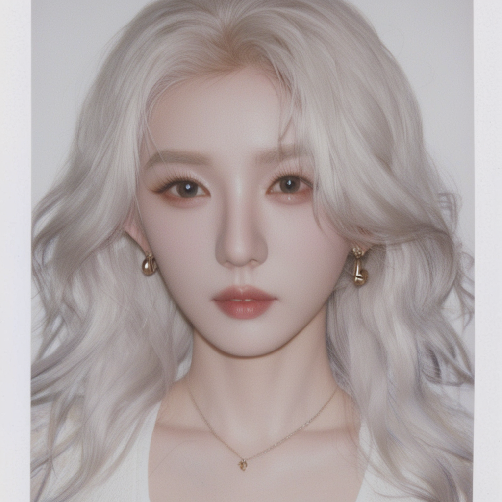
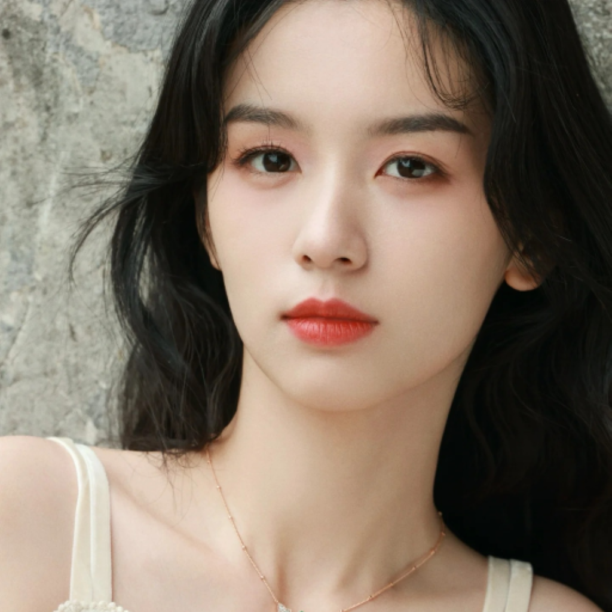
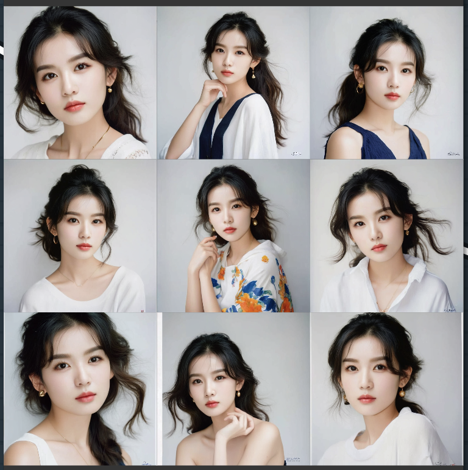

📷 撕拉片风格照片生成器

本项目基于 Stable Diffusion XL (SDXL) + LoRA 微调 实现撕拉片（Silapian Style）风格照片的训练与生成。

同时结合 IP-Adapter FaceID 技术，在生成过程中尽可能保留人物的面部特征，使得输出更贴近真实人物。

📷 效果示例

只用Lora

Lora + ip-adapter

✨ 功能亮点

🎨 LoRA 微调：仅需 30 张撕拉片风格照片即可完成训练

📷 FaceID 人脸还原：保留目标人脸的细节与特征

⚡ 高分辨率支持：模型支持 1024×1024 分辨率训练与推理

🎨 独特艺术表现**：专注于呈现独具匠心的撕拉片艺术风格，为图像生成注入创意。

📂 数据准备

1.收集 30 张撕拉片风格照片（建议清晰、构图风格统一）

2。为每张图片编写对应的文本描述（caption），可使用BLIP进行批量编写

3.数据集目录示例：

dataset/

   ├── img001.jpg
   
   ├── img002.jpg
   
   ├── ...
   
   ├── data.csv   # 包含文件名与caption
   
🏋️‍♂️ 训练流程

使用 [HuggingFace diffusers 官方 train_text_to_image_lora_sdxl.py 脚本](https://github.com/huggingface/diffusers/blob/main/examples/text_to_image/train_text_to_image_lora_sdxl.py) 进行 LoRA 训练。

运行 LoRA 训练脚本（基于 diffusers 库）：

accelerate launch train_text_to_image_lora_sdxl.py \
  --pretrained_model_name_or_path="基础模型路径" \
  --pretrained_vae_model_name_or_path="VAE路径" \
  --dataset_name="训练数据路径" \
  --caption_column="text" \
  --image_column="image" \
  --resolution=1024 \
  --train_batch_size=1 \
  --gradient_accumulation_steps=4 \
  --num_train_epochs=200 \
  --checkpointing_steps=140 \
  --learning_rate=1e-4 \
  --lr_scheduler="cosine" \
  --lr_warmup_steps=0 \
  --mixed_precision="fp16" \
  --variant="fp16" \
  --seed=42 \
  --output_dir="数据保存路径" \
  --report_to="tensorboard" \
  --train_text_encoder \
  --use_8bit_adam \
  --enable_xformers_memory_efficient_attention \
  --rank=32 \
  --validation_prompt="one beautiful girl, silapian_style" \
  --num_validation_images=1 \
  --validation_epochs=20
💡 小技巧

建议保存 10-15 个 checkpoint，方便对比效果并选择最佳模型

学习率 1e-4 对少量照片训练较稳定，可按需调整

📥 LoRA 权重下载

[HuggingFace 模型链接](https://huggingface.co/yuhuaixu/silapian_style_lora)

🖼️ 推理生成

加载 SDXL 基础模型 和训练好的 LoRA 权重

在提示词中加入训练时的特殊 token，例如：

one beautiful girl, silapian_style

使用 IP-Adapter FaceID（提供参考人脸图片），在保持撕拉片风格的同时还原人脸特征

💣存在不足

在人脸一致性上存在差距，无法很好还原面部特征。

如果是对特定人物进行风格转换，或许可以训练一个人物Lora，这样还原度会比较好点。

此外，在comfyui的流程中使用更新版本的plusv2，效果有所改善。

后续将继续探索更好的方式去保证人脸一致性。

📝 License

本项目仅限研究与学习用途，禁止商业化使用。

