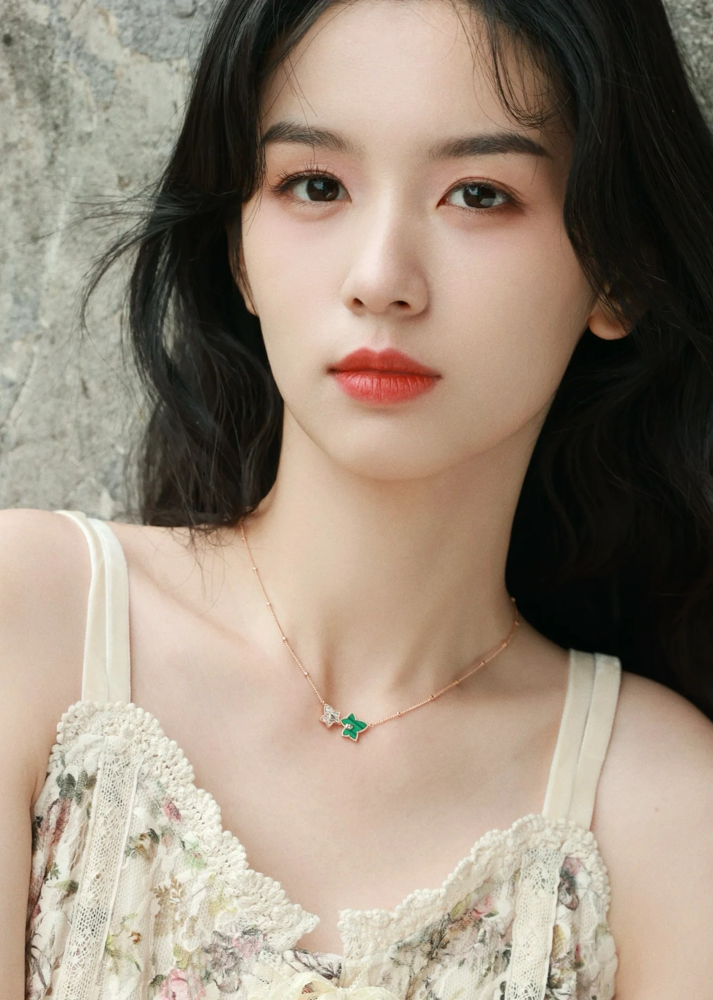
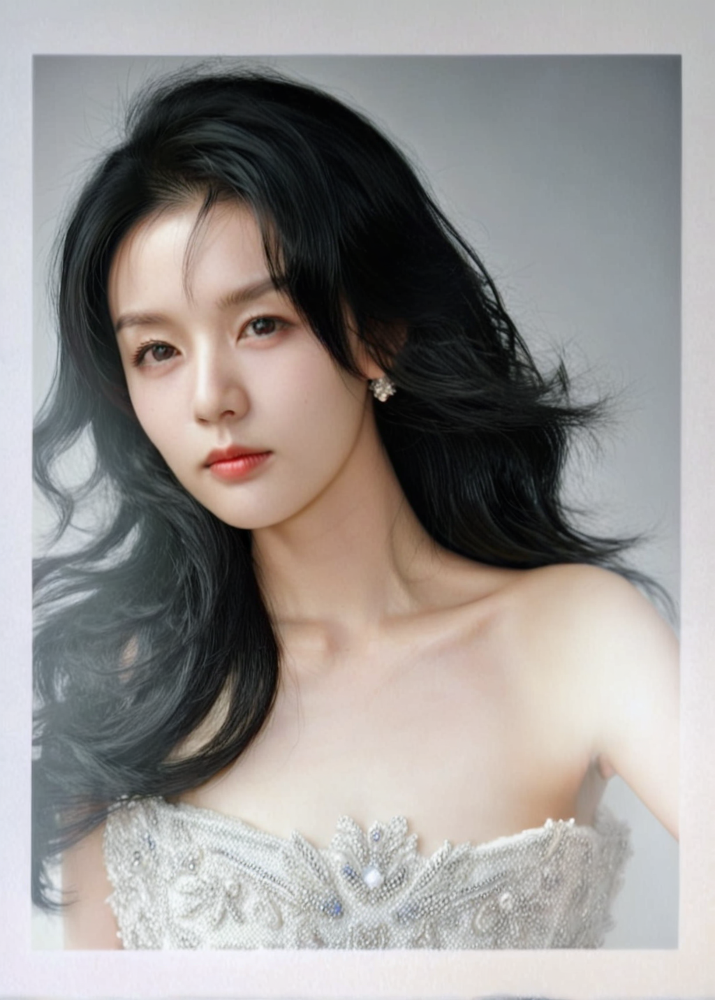

# 📷 撕拉片风格照片生成器

本项目基于 **Stable Diffusion XL (SDXL)** + **LoRA 微调**，实现撕拉片（Silapian Style）风格照片的训练与生成。结合 **IP-Adapter FaceID** 和 **ControlNet** 技术，在生成过程中尽可能保留人物的面部和形体特征，使输出更贴近真实人物。

---

## 🎨 效果示例

**推荐参数：**  
CFG = 4.0-6.0 | Steps = 20-35 | 调度器：dpmpp_2m + karras

### 文生图

- **只用 LoRA**

  

- **LoRA + IP-Adapter**

  

- **LoRA + IP-Adapter + ControlNet**

  

### 图生图

- **LoRA + IP-Adapter + ControlNet**

  

---

## ✨ 功能亮点

- **LoRA 微调**：仅需 30 张撕拉片风格照片即可完成训练
- **FaceID 人脸还原**：保留目标人脸的细节与特征
- **高分辨率支持**：支持 1024×1024 分辨率训练与推理
- **独特艺术表现**：专注于撕拉片艺术风格，赋予图像生成更多创意

---

## 📂 数据准备

1. 收集 30 张撕拉片风格照片（建议清晰、构图风格统一）
2. 为每张图片编写对应的文本描述（caption），可使用 BLIP 批量生成
3. 数据集目录示例：

   ```
   dataset/
     ├── img001.jpg
     ├── img002.jpg
     ├── ...
     ├── data.csv   # 包含文件名与 caption
   ```

---

## 🏋️‍♂️ 训练流程

使用 [HuggingFace diffusers 官方 LoRA 训练脚本](https://github.com/huggingface/diffusers/blob/main/examples/text_to_image/train_text_to_image_lora_sdxl.py) 进行 LoRA 微调。

运行命令示例：

```bash
accelerate launch train_text_to_image_lora_sdxl.py \
  --pretrained_model_name_or_path="基础模型路径" \
  --pretrained_vae_model_name_or_path="VAE路径" \
  --dataset_name="训练数据路径" \
  --caption_column="text" \
  --image_column="image" \
  --resolution=1024 \
  --train_batch_size=1 \
  --gradient_accumulation_steps=4 \
  --num_train_epochs=200 \
  --checkpointing_steps=140 \
  --learning_rate=1e-4 \
  --lr_scheduler="cosine" \
  --lr_warmup_steps=0 \
  --mixed_precision="fp16" \
  --variant="fp16" \
  --seed=42 \
  --output_dir="数据保存路径" \
  --report_to="tensorboard" \
  --train_text_encoder \
  --use_8bit_adam \
  --enable_xformers_memory_efficient_attention \
  --rank=32 \
  --validation_prompt="one beautiful girl, silapian_style" \
  --num_validation_images=1 \
  --validation_epochs=20
```

**小技巧：**
- 建议保存 10-15 个 checkpoint，方便对比效果并选择最佳模型
- 学习率 1e-4 对少量照片训练较稳定，可按需调整

---

## 📥 LoRA 权重下载

- [HuggingFace 模型链接](https://huggingface.co/yuhuaixu/silapian_style_lora)

---

## 🖼️ 推理生成

加载 [SDXL](https://huggingface.co/stabilityai/stable-diffusion-xl-base-1.0) 或 [SG161222/RealVisXL](https://huggingface.co/SG161222) 基础模型和训练好的 LoRA 权重。

推理时在提示词中加入训练时的特殊 token，例如：

```
one beautiful girl, silapian_style
```

- 使用 IP-Adapter FaceID（提供参考人脸图片），在保持撕拉片风格的同时还原人脸特征。
- 使用 ControlNet 控制人物形态。

---

## 💣 已知不足和改进想法

- 人脸一致性存在差距，单张照片难以很好还原面部特征。
- 若对特定人物进行风格转换，建议训练人物专属 LoRA，可提升还原度。
- 在 comfyui 的流程中使用 plusv2 版本，效果有所改善。
- 后续将继续探索更优方式提升人脸一致性。

---

## 📝 License

本项目仅限研究与学习用途，禁止商业化使用。


